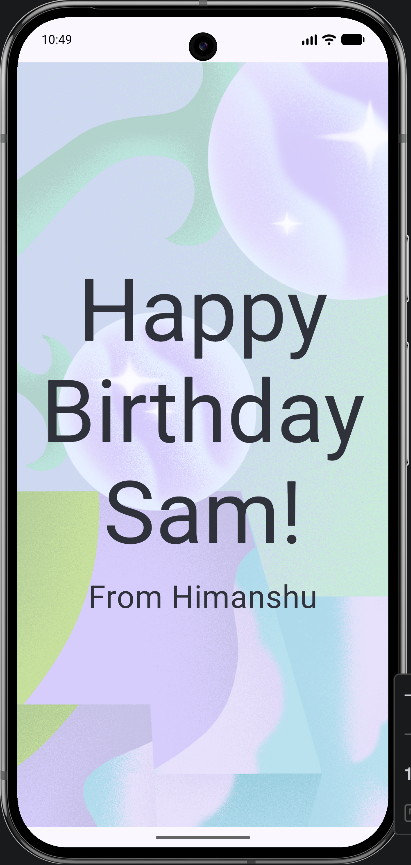
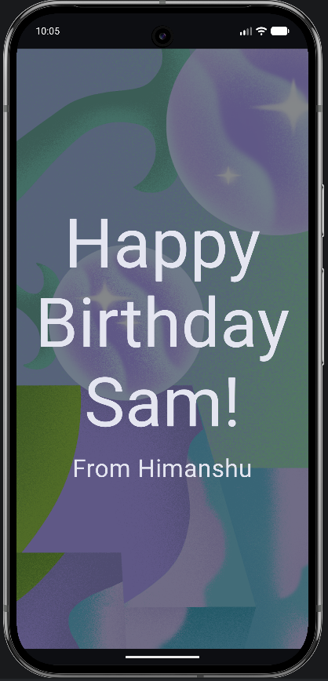

# 🎂 Happy Birthday Card App

**A modern Android application built with Jetpack Compose to celebrate special moments.**

---

## 📱 About The App

This project is a demonstration of **modern Android development** using declarative UI. It displays a customized birthday greeting card featuring a festive background image and styled typography. It serves as a perfect example of how to layer composables using `Box`, `Column`, and `Row` layouts.

**Key Features:**

* 🎉 **Immersive UI**: Full-screen background image with overlay content.
* 🎨 **Custom Styling**: Large, bold typography with specific font sizing and line heights.
* 🌗 **Theme Aware**: Built on Material3 foundation.
* 🧩 **Composable Architecture**: Clean separation of UI components (`GreetingText`, `GreetingImage`).

---

## 📸 Screenshots

| Light Mode          | Dark Mode                 |
|---------------------|---------------------------|
|  |  |

---

## 🛠️ Built With

The project leverages the latest tools in the Android Ecosystem:

| Technology | Purpose |
| --- | --- |
| **[Kotlin](https://kotlinlang.org/)** | Primary programming language. |
| **[Jetpack Compose](https://developer.android.com/jetpack/compose)** | Modern toolkit for building native UI. |
| **[Material3](https://m3.material.io/)** | Design system for styling and theming. |
| **[Android Studio](https://developer.android.com/studio)** | IDE and build tools. |

---

## 🚀 Getting Started

Follow these steps to get a copy of the project up and running on your local machine.

### Prerequisites

* Android Studio Ladybug (or newer recommended)
* JDK 21 (configured in project settings)

### Installation

1. **Clone the repository**
```bash
git clone https://github.com/your-username/HappyBirthdayCard.git

```


2. **Open in Android Studio**
* File > Open > Select the `HappyBirthdayCard` folder.


3. **Sync Gradle**
* Allow the project to sync dependencies.


4. **Run the App**
* Select an emulator or connected device and click the **Run** button (▶️).


---

## 💡 Code Highlights

Here is how the main card composition is structured using `Box` to layer text over an image:

```kotlin
@Composable
fun GreetingImage(message: String, from: String, modifier: Modifier = Modifier) {
    val image = painterResource(R.drawable.androidparty)
    
    // Box allows stacking elements on top of each other
    Box(modifier) {
        Image(
            painter = image,
            contentDescription = null,
            contentScale = ContentScale.Crop,
            alpha = 0.5f // Adds a subtle transparency
        )
        GreetingText(
            message = message,
            from = from,
            modifier = Modifier
                .fillMaxSize()
                .padding(8.dp)
        )
    }
}

```

---

## 🤝 Contributing

Contributions are what make the open-source community such an amazing place to learn, inspire, and create. Any contributions you make are **greatly appreciated**.

1. Fork the Project
2. Create your Feature Branch (`git checkout -b feature/AmazingFeature`)
3. Commit your Changes (`git commit -m 'Add some AmazingFeature'`)
4. Push to the Branch (`git push origin feature/AmazingFeature`)
5. Open a Pull Request

---

Made with ❤️ by [Himanshu](https://www.google.com/search?q=https://github.com/himanshu20050118)