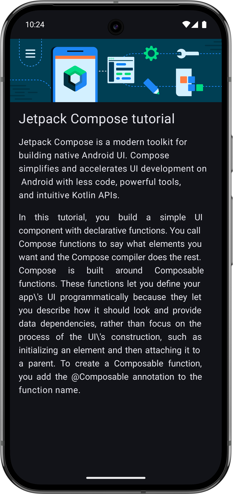
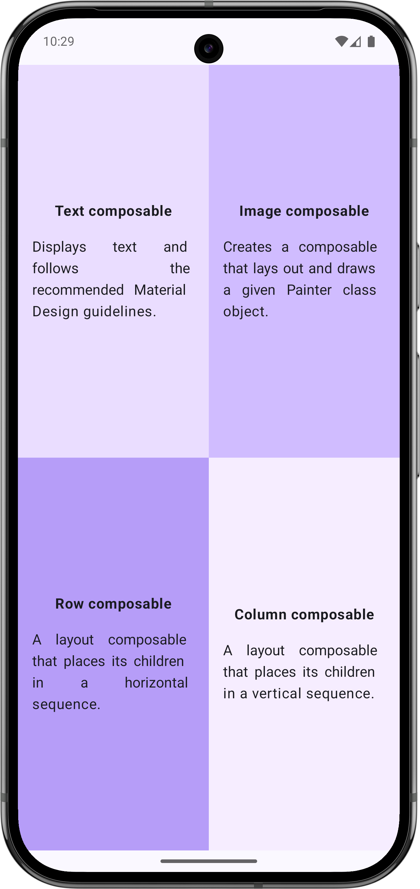
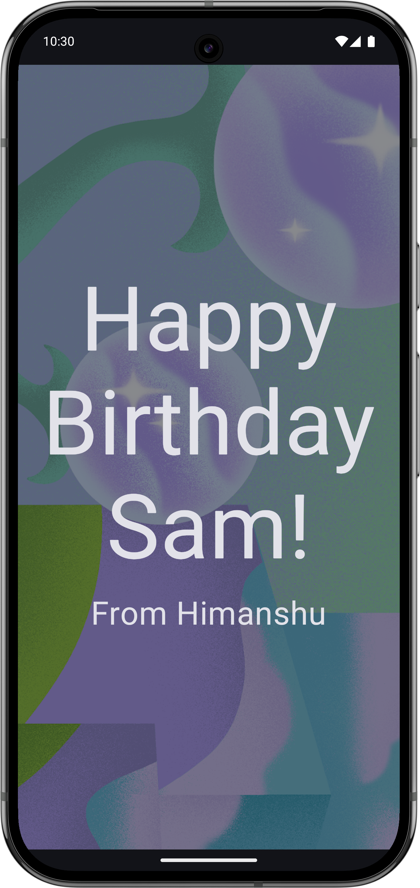
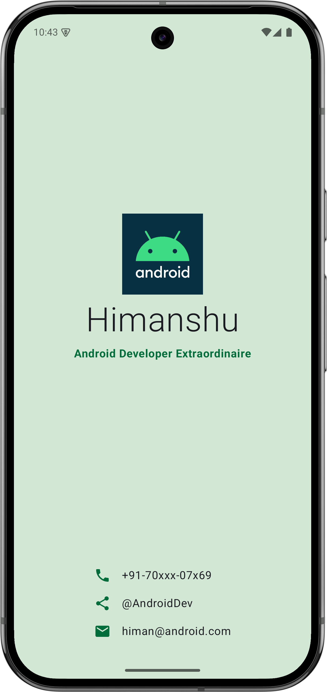
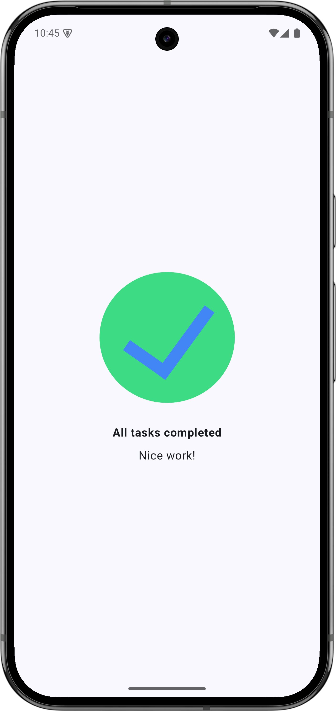

# 🚀 The Compose Playground

<div align="center">


**A comprehensive showcase of modern Android development using Declarative UI.**

</div>

---

## 🌟 Overview
Welcome to **The Compose Playground**! This repository is a deep dive into **Jetpack Compose**, exploring everything from basic layouts to complex UI compositions. Each project here is a building block in mastering the art of building intuitive, performant, and beautiful Android applications.

---

## 📱 Project Deep Dives

### 📰 1. Compose Article
A foundational project focusing on content hierarchy and text styling.
- **Key Concepts:** `Column` layout, `Image` scaling, `TextAlign.Justify`.
- **Technical Detail:** Implements a vertical stack using `Column` to seamlessly blend a hero image with a title and multi-paragraph text. It uses `stringResource` for localization and `painterResource` for efficient asset loading.
- **Visuals:**
  <br/>
  

---

### 🎨 2. Compose Quadrant
An exploration of screen segmentation and weight-based layouts.
- **Key Concepts:** `Modifier.weight()`, `Row` and `Column` nesting, Background color management.
- **Technical Detail:** This project demonstrates how to divide the viewport into equal sections using the `weight` modifier. Each quadrant is a reusable composable that encapsulates its own styling and alignment logic.
- **Visuals:**
  <br/>
  

---

### 🎂 3. Happy Birthday Card
A creative take on layering and visual aesthetics.
- **Key Concepts:** `Box` layout (Z-axis stacking), `ContentScale.Crop`, Alpha transparency.
- **Technical Detail:** Utilizes the `Box` composable to layer text over a full-screen background image. It showcases how to use `ContentScale` to maintain aspect ratios and `alpha` modifiers to ensure text readability against busy backgrounds.
- **Visuals:**
  <br/>
  

---

### 💳 4. Profile Card
A professional UI component showcasing contact information and branding.
- **Key Concepts:** Material Icons, `Surface` containers, `Arrangement.Center`.
- **Technical Detail:** Features a sophisticated layout with a top branding section and a bottom contact list. It makes extensive use of `Vector Graphics (ImageVector)` and custom `Row` components to create a clean, modern digital business card.
- **Visuals:**
  <br/>
  

---

### ✅ 5. Task Manager UI
A minimal and feedback-oriented user interface.
- **Key Concepts:** `Arrangement.Center`, `FontWeight.Bold`, Material3 `Surface`.
- **Technical Detail:** Focuses on perfect centering of elements using `verticalArrangement` and `horizontalAlignment`. It demonstrates the use of typography weights to create visual hierarchy in simple informative screens.
- **Visuals:**
  <br/>
  

---

## 🛠️ Technical Stack & Tooling

- **Language:** Kotlin 1.9+ 🛡️
- **UI Framework:** Jetpack Compose (Material 3) 🎨
- **Architecture:** Declarative UI Patterns 🏗️
- **Build System:** Gradle (Kotlin DSL) 🐘
- **Targeting:** Android SDK 34+ 📱

## 🚀 Getting Started

1.  **Clone the Repo:**
    ```bash
    git clone https://github.com/rathee-dev/The-Compose-Playground.git
    ```
2.  **Open in Android Studio:**
    Select any sub-folder (e.g., `ProfileCard`) to open it as a standalone project.
3.  **Run & Explore:**
    Hit `Shift + F10` to see the magic happen on your device!

---

<div align="center">

**Created with ❤️ by Himanshu**
*Exploring the future of Android, one Composable at a time.*

</div>
